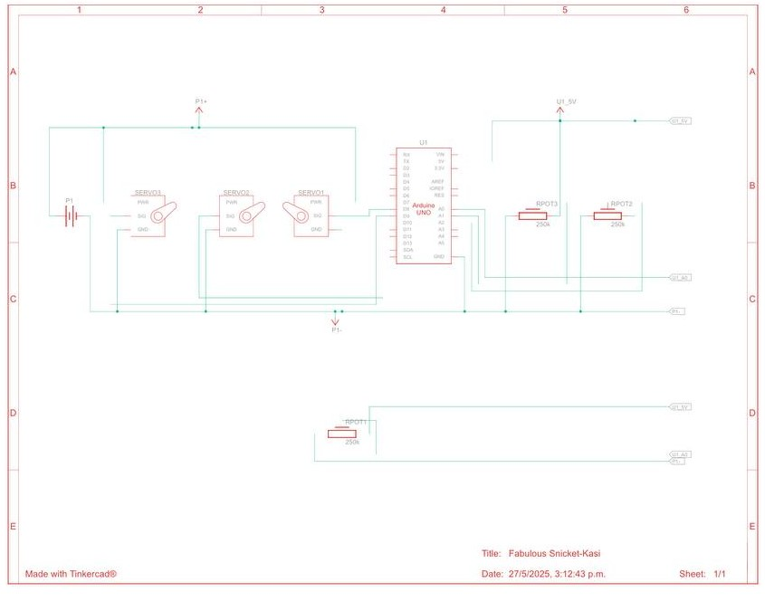
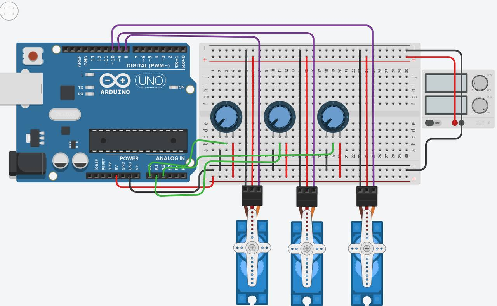

# Arduino - Potenciometro y Servos

Controlaremos cada motor con un potenciometro asignado

## Materiales
- Arduino Uno 
- Fuente de Alimentacion de 5 volts
- 3 Microservomotor
- 3 potenciometros de 250 kilo oms

## Esquema de conecion

## Visualizacion de conecion
